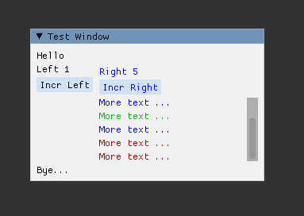

# C++11 syntactic sugar for ImGui with RAII guards

This single header library adds a clean DSL (syntax sugar) to
construct ImGui interfaces in c++11. It manages the stack with transparent
RAII guards.

## Requirements

* c++11
* [Dear ImGui](https://github.com/ocornut/imgui)

## Install

Just add `imgui_sugar.hpp` to your sources and include it when required.

## Example usage

```cpp
#include <imgui/imgui.h>
#include <imgui_sugar.hpp>

// ...

    static int left = 0, right = 0;
    ImGui::SetNextWindowPos(ImVec2(30, 50), ImGuiCond_FirstUseEver);
    set_StyleColor(ImGuiCol_WindowBg, ImVec4{0.88f, 0.88f, 0.88f, 1.0f});        
    set_StyleColor(ImGuiCol_Text, 0xff000000);

    with_Window("Test Window", nullptr, ImGuiWindowFlags_AlwaysAutoResize) {

        ImGui::Text("Hello");
        
        with_Group {
            ImGui::Text("Left %d", left);
            if (ImGui::Button("Incr Left"))
                ++left;
        }
        
        ImGui::SameLine();
        
        with_Group {
            set_StyleColor(ImGuiCol_Text, 0xffff0000);
        
            ImGui::Text("Right %d", right);
        
            if (ImGui::Button("Incr Right"))
                ++right;
        
            with_Child("##scrolling", ImVec2(200, 80)) {

                ImGui::Text("More text ...");
                ImGui::Text("More text ...");
                ImGui::Text("More text ...");
                
                with_StyleColor(ImGuiCol_Text, ImVec4{ 0, 0.5f, 0, 1.0f })
                    ImGui::Text("More text ...");
                
                ImGui::Text("More text ...");
                
                with_StyleColor(ImGuiCol_Text, ImVec4{ 0.5f, 0.0f, 0, 1.0f }) {
                    ImGui::Text("More text ...");
                    ImGui::Text("More text ...");
                }
            }
        }

        ImGui::Text("Bye...");
    }    


// ...

```



## Rational

* Macros named `with_*` do start its own scope and automatically call End/Pop as required. (Yes the case where End/Pop call is unconditionall is respected).

```cpp
with_Window(...) { 
    // ....
}

// If the scope contains a single statement, brackets are optional as usual.
with_StyleColor(ImGuiCol_Text, ImVec4{ 0, 0.5f, 0, 1.0f })
    ImGui::Text("More text ...");

```

* Macros named `set_*` do not start its own scope but its state is managed by the surrounding scope.

```cpp
{
    set_StyleColor(...);
    // ...
}

```


## Scope definitions 

Sugar function                |Begin Call               |End Call |
| --- | --- | --- |
|with_Window(...) { ... }             |ImGui::Begin,                   |ImGui::End |               
|with_Child(...) { ... }              |ImGui::BeginChild,              |ImGui::EndChild |          
|with_ChildFrame(...) { ... }         |ImGui::BeginChildFrame,         |ImGui::EndChildFrame |     
|with_Combo(...) { ... }              |ImGui::BeginCombo,              |ImGui::EndCombo |          
|with_ListBox(...) { ... }            |ImGui::BeginListBox,            |ImGui::EndListBox |        
|with_MenuBar(...) { ... }            |ImGui::BeginMenuBar,            |ImGui::EndMenuBar |        
|with_MainMenuBar(...) { ... }        |ImGui::BeginMainMenuBar,        |ImGui::EndMainMenuBar |    
|with_Menu(...) { ... }               |ImGui::BeginMenu,               |ImGui::EndMenu |           
|with_Popup(...) { ... }              |ImGui::BeginPopup,              |ImGui::EndPopup |          
|with_PopupModal(...) { ... }         |ImGui::BeginPopupModal,         |ImGui::EndPopup |          
|with_PopupContextItem(...) { ... }   |ImGui::BeginPopupContextItem,   |ImGui::EndPopup |          
|with_PopupContextWindow(...) { ... } |ImGui::BeginPopupContextWindow, |ImGui::EndPopup |          
|with_PopupContextVoid(...) { ... }   |ImGui::BeginPopupContextVoid,   |ImGui::EndPopup |          
|with_Table(...) { ... }              |ImGui::BeginTable,              |ImGui::EndTable |          
|with_TabBar(...) { ... }             |ImGui::BeginTabBar,             |ImGui::EndTabBar |         
|with_TabItem(...) { ... }            |ImGui::BeginTabItem,            |ImGui::EndTabItem |        
|with_DragDropSource(...) { ... }     |ImGui::BeginDragDropSource,     |ImGui::EndDragDropSource | 
|with_DragDropTarget(...) { ... }     |ImGui::BeginDragDropTarget,     |ImGui::EndDragDropTarget | 
|with_Group { ... }                   |ImGui::BeginGroup,              |ImGui::EndGroup |
|with_Tooltip { ... }                 |ImGui::BeginTooltip,            |ImGui::EndTooltip |
|with_Font(...) { ... }               |ImGui::PushFont,                |ImGui::PopFont |               
|with_AllowKeyboardFocus(...) { ... } |ImGui::PushAllowKeyboardFocus,  |ImGui::PopAllowKeyboardFocus | 
|with_ButtonRepeat(...) { ... }       |ImGui::PushButtonRepeat,        |ImGui::PopButtonRepeat |       
|with_ItemWidth(...) { ... }          |ImGui::PushItemWidth,           |ImGui::PopItemWidth |          
|with_TextWrapPos(...) { ... }        |ImGui::PushTextWrapPos,         |ImGui::PopTextWrapPos |        
|with_ID(...) { ... }                 |ImGui::PushID,                  |ImGui::PopID |                 
|with_ClipRect(...) { ... }           |ImGui::PushClipRect,            |ImGui::PopClipRect |           
|with_TextureID(...) { ... }          |ImGui::PushTextureID,           |ImGui::PopTextureID |          
|with_StyleColor(...) { ... }         |ImGui::PushStyleColor,          |ImGui::PopStyleColor |           
|with_StyleVar(...) { ... }           |ImGui::PushStyleVar,            |ImGui::PopStyleVar |          
|with_TreeNode(...) { ... }           |ImGui::TreeNode                 |ImGui::TreePop |
|with_TreeNodeV(...) { ... }          |ImGui::TreeNodeV                |ImGui::TreePop |
|with_TreeNodeEx(...) { ... }         |ImGui::TreeNodeEx               |ImGui::TreePop |
|with_TreeNodeExV(...) { ... }        |ImGui::TreeNodeExV              |ImGui::TreePop |
|with_CollapsingHeader(...) { ... }   |ImGui::CollapsingHeader         | |           

## Parent scoped guards 

Sugar function |Begin Call |End Call |
| --- | --- | --- |
|set_StyleColor(...) |ImGui::PushStyleColor, |ImGui::PopStyleColor |           
|set_StyleVar(...)   |ImGui::PushStyleVar,   |ImGui::PopStyleVar |          

## Abstraction cost

* All guards do store a function pointer to the end callback and a boolean member with the returned value from begin callback.
* No heap allocations are done at all.

## Disclaimers

* No guarantees.
* This is very opinionated.
* This uses templates and macros.
* This is **not a proposal**, just something that you can use if you like it.

## Contributions

Discussions and PRs are welcome :)